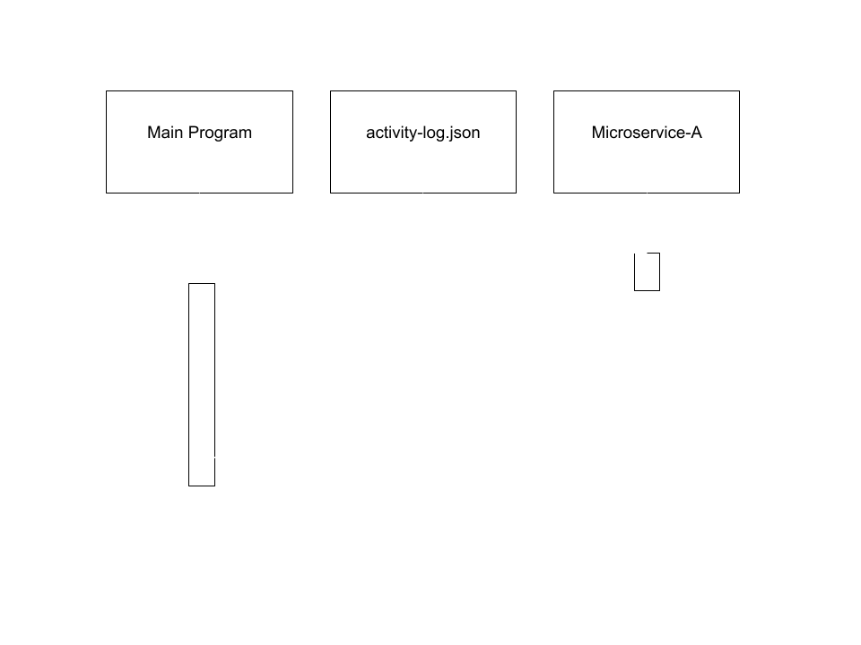

# Microservice-A (Keyboard and Mouse Activity Tracker)

This microservice automatically logs keyboard activity, mouse clicks, and mouse movement into a local "activity-log.json" file. Logging occurs once per second, but only when user input is detected. It is designed to support applications like Pomodoro timers by detecting signs of user distraction or inactivity.

# How to set up the microservice:
1. Download the microservice-a files
2. Enter this command in terminal to install dependencies "pip install flask pynput"
3. Start the microservice by entering the following command "python app.py"
4. To stop the microservice, simply enter the following command in terminal CTRL+C 

After starting the microservice, it will automatically create a "activity-log.json" file if one doesn't already exist. After creation, the microservice will begin logging keyboard and mouse activity into the JSON file every second

*** If the command for step 2 doesn't work enter this: "pip3 install flask pynput"
*** If the command for step 3 doesn't work enter this: "python3 app.py"

# COMMUNICATION CONTRACT
This section will outline how to request and receive data from the microservice

# How to REQUEST data
To request data, your program will be reading the inputs made into
the "activity-log.json" file that is automatically updated every second by the microservice whenever activity is detected.

*** DO NOT MODIFY OR OVERWRITE THE JSON FILE ***

Example Request (Python)
**    import json
**
**    with open("activity-log.json", "r") as file:
**       logs = json.load(file)

# How to RECEIVE data
To receive data, the microservice will read and process the entires from the
"activity-log.json" file. Each entry in the file represents a second of deteced
user activity and is structured as a JSON object inside a JSON array.

Example Receive (Python)
**    import json
**
**    with open("activity-log.json", "r") as file:
**       logs = json.load(file)
**
**    for entry in logs:
**        print(
**            for entry in logs:
**            timestamp = entry.get("timestamp", "N/A")
**            clicks = entry.get("clicks", 0)
**            keystrokes = entry.get("keystrokes", 0)
**            print(f"{timestamp} — Clicks: {clicks}, Keystrokes: {keystrokes}")

# UML SEQUENCE DIAGRAM

